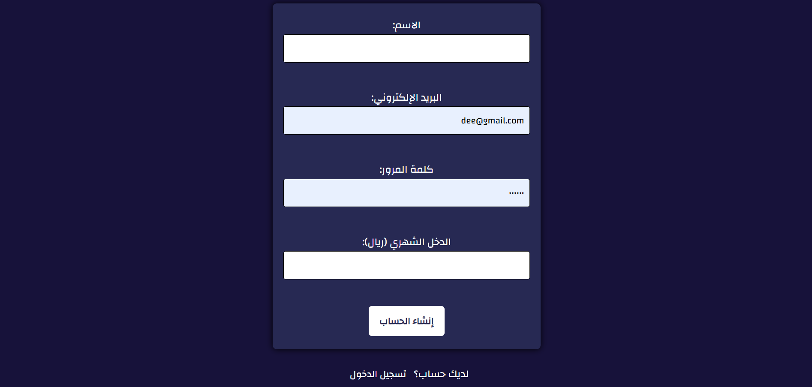
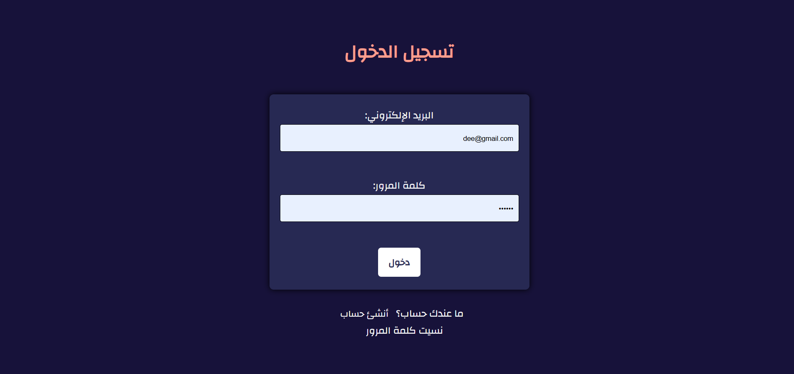
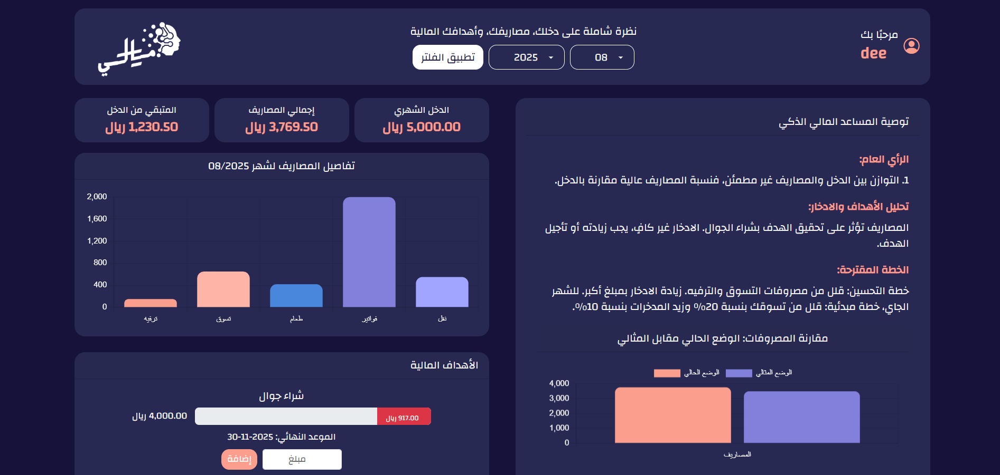
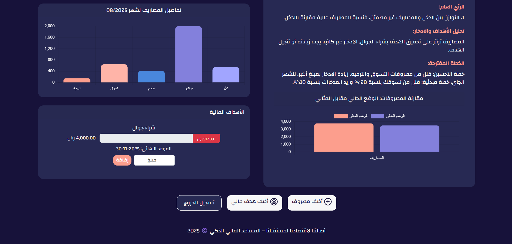
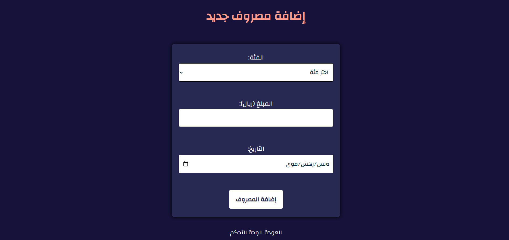
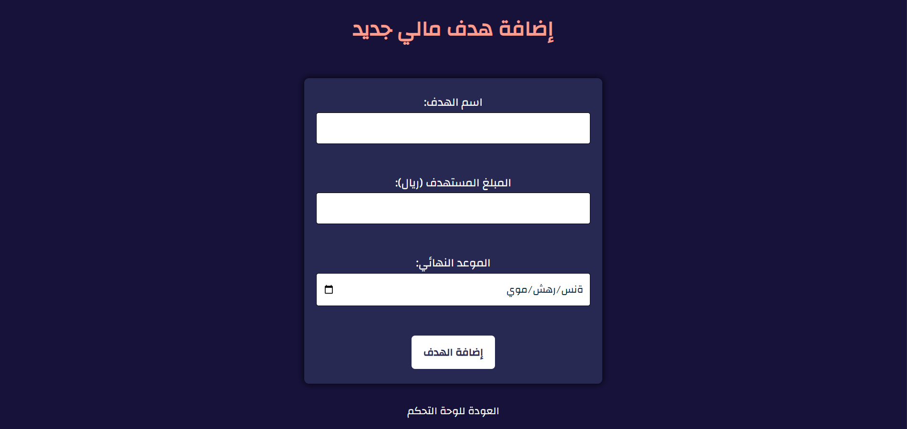
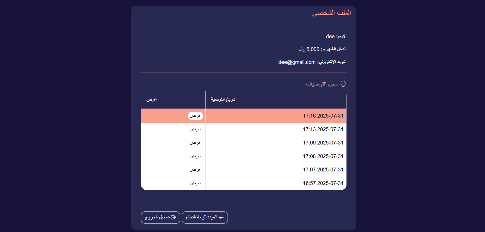
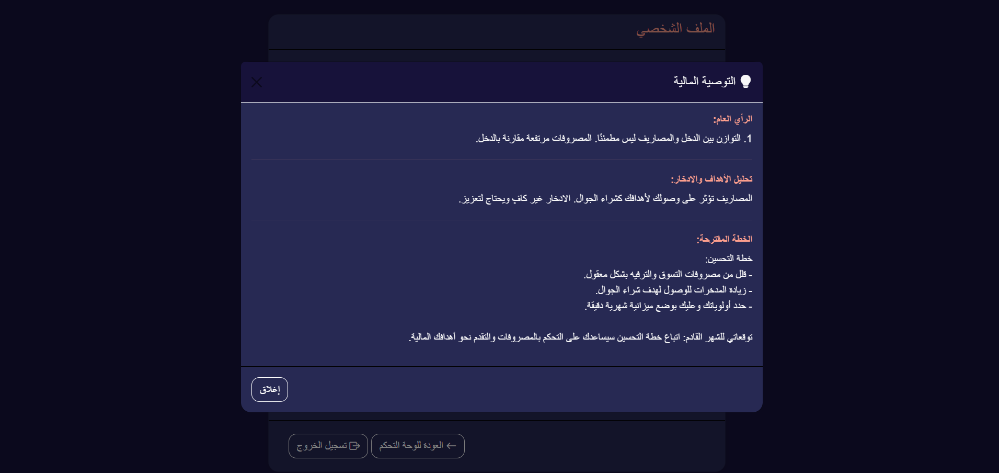

# maly
# a smart Financial Assistant

 maly  is a web application that helps users manage their personal finances, track expenses, set financial goals, and receive AI-powered recommendations for better money management.

## Features

- **User Registration & Login:** Secure authentication for users.
- **Dashboard:** Overview of income, expenses, and financial goals.
- **Expense Tracking:** Add and categorize expenses.
- **Goal Management:** Set, update, and track progress toward financial goals.
- **AI Recommendations:** Get personalized financial advice using OpenAI GPT.
- **Profile Page:** View user info and recommendation history.
- **Responsive Design:** Modern, RTL-friendly interface.

## Project Structure

```
add_goal.php
add_transaction.php
dashboard.php
db.php
index.php
login.php
logout.php
profile.php
register.php
update_goal.php
sql/
  schema.sql
  smart_finance.sql
style/
  bg.jpg
  logo.png
  style.css
```

## Setup Instructions

1. **Clone or Download the Project**

2. **Database Setup**
   - Import the SQL schema from [`sql/schema.sql`](sql/schema.sql) or [`sql/smart_finance.sql`](sql/smart_finance.sql) into your MySQL server.
   - Update database credentials in [`db.php`](db.php) if needed.

3. **Web Server**
   - Place the project in your web server directory (e.g., `htdocs` for XAMPP).
   - Make sure PHP and MySQL are running.

4. **OpenAI API Key**
   - Replace the placeholder API key in [`dashboard.php`](dashboard.php) with your own OpenAI API key for recommendations.

5. **Access the App**
   - Open `index.php` in your browser to start using the app.

## Dependencies

- PHP 7.4+
- MySQL/MariaDB
- [OpenAI API](https://platform.openai.com/)
- [Bootstrap 5](https://getbootstrap.com/) (CDN)
- [Chart.js](https://www.chartjs.org/) (CDN)
- [Lucide Icons](https://lucide.dev/) (CDN)
- [Animate.css](https://animate.style/) (CDN)

## Screenshots










## License

This project is Developed for the AMD Hackathon 2025.


---

**Developed by:** hadeel alanazi and rawabi alanazi
